# Praval's Motion Planning Library

# Table Of Contents
- [Installation](#installation)
- [Environments](#environments)
- [Robots](#robots)
- [Search Algorithms](#search-algorithms)
- [Accelerated Collision Checks](#accelerated-collision-checks)
- [Acknowledgements](#acknowledgements)

# Usage

## Installation

<!-- Python Version: `>=3.12.9`

Install via pip
```
pip install pmpl-robot
```

Install via Source
1. Clone the Repository
```
git clone https://github.com/pmvt19/motion_planning_library.git
```

2. Change Directories into the `motion_planning_library` directory
```
cd motion_planning_library/
```

3. Install the Package
```
pip install -e .
``` -->

## Environments

### Deterministic Environments

#### Parking Space Environment

<!--  -->
<p align="center">

</p>

### Probabilistic Environments

### Biased Passage
Parameters:
`Num Walls`
`Bias`

<!--  -->
<p align="center">

</p>

### Random Sample Passage
Parameters:
`Num Walls`
`Gap Width`

<!--  -->
<p align="center">

</p>

## Robots

### Point Robot

This robot is a zero-radius point in 2D workspace. 

Configuration space: [$`x`$, $y$]

<p align="center">
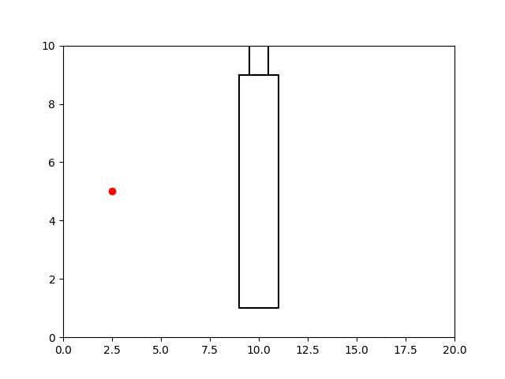
</p>

### Disc Robot

This robot is disc with radius $R$ 2D workspace. 

Configuration space: [$`x`$, $y$]

Parameters:
`Radius`

<p align="center">
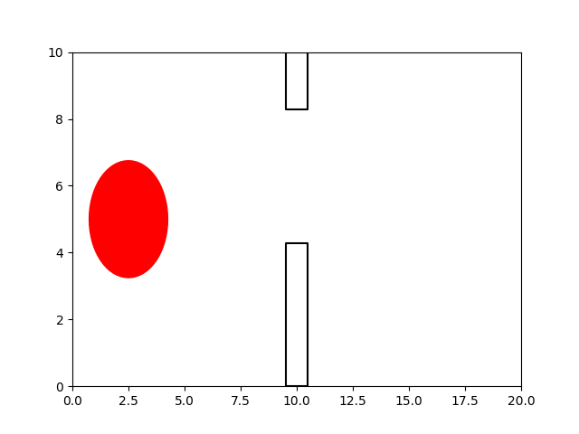
</p>

### Polygonal Robot

This robot is rectangle with distinct height and width in 2D workspace. The positional compoenent of the state represents the center of the rectangle while the orientation is represented by $\theta$.

Configuration space: [$`x`$, $y$, $\theta$]

Parameters:
`Height`
`Width`

<!--  -->
<p align="center">

</p>

### Planar Mobile Arm

This robot is mobile arm with a distinct height and width for the base and $N$ number of links for the arms in 2D workspace. The positional component of the state represents the center of the rectangular base while the $\theta_i$ components represent the position of the $i\text{-th}$ arm.

Configuration space: [$`x`$, $y$, $\theta_1$, $\theta_2$, ..., $\theta_N$]

Parameters:
`Base Height?`
`Base Width?`
`Number of Links`
`Length of Links`

<p align="center">
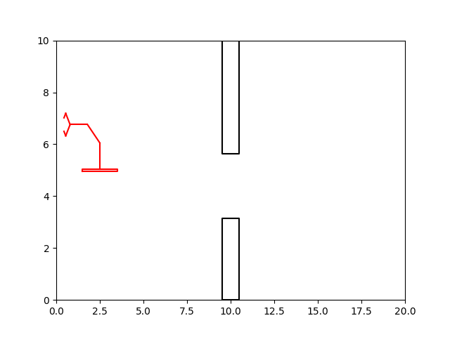
</p>


## Search Algorithms

This library mostly explores a class of motion planning algorithms known as sampling-based motion planning algorithms. This means each planning algorithm relies on probabilistic properties to alleviate some of the heavy compuation required for classical motion planning algorithms.

*Disclaimer:* The current implementations for visualizations only show the first two dimensions of the configurations. For some robots, this is the entire dimensionality of the $`\mathcal{C}`$-Space, while for others it is only a partial visualization for the spatial components.

### RRT (Rapidly-Exploring Random Tree)

Steps:
<!-- Add Math Notation? -->
1. Initialize Search Tree with Root Node as Start
2. Randomly Sample a Valid Point in the $\mathcal{C}$-Space
3. Find the Closest Node on the Search Tree to the Sampled Point
4. Extend the Closest Node a Fixed Distance $\delta$ Toward the Sampled Point and Add this Node as a Child of the Closest Node
5. Repeat steps 2-4 until the target is within a certain distance of the new node

<p align="center">
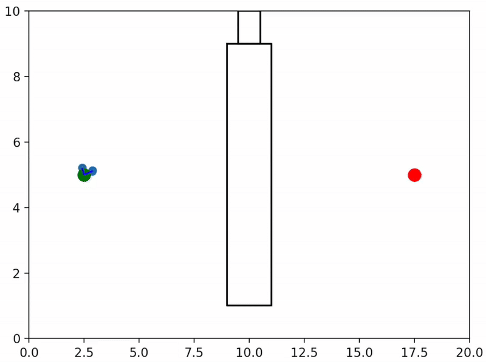
</p>

#### Why this works

RRT is inherently biased to expore open regions of the $\mathcal{C}$-Space first, then fill in the gaps later due to the **voronoi bias**. 

The voronoi diagram (pictured below) partitions the space into regions where all points in a given region are closest to a single point. Intuitively this means, that larger regions are more unexplored while smaller regions are explored since the larger region has a lot of space closest to a single point.

If we sample a node uniformly from the $`\mathcal{C}`$-Space, then it is more likely that this sampled point lives in a larger region. You can think of the proportion of area for each region in the voronoi diagram as the probability that we expand in that region. This inherently biases expansion in more unexplored areas.

<!--  -->
<p align="center">

</p>

### Bi-Directional RRT

Bi-Directional RRT attempts to grow two trees: one from the start (just like RRT) and one from the target. If the trees have any nodes within a certain thresholded distance between them and the edge connecting the two nodes are valid, then the trees connect and a valid path between the start and the target is found.

The following is a GIF showing the start tree (orange) and the target tree (blue) growing towards each other and connecting in the middle:
<p align="center">
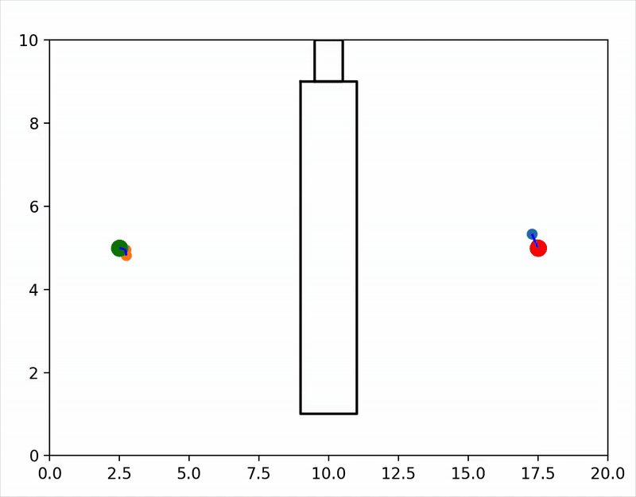
</p>

### RRT*

Unlike RRT, RRT* attempts to find an asymptotically optimal path (i.e. the shortest path between configuration $p$ and $q$). This is done by adding an additional step to the RRT expansion step: rewiring. The goal of the rewiring step is to make the newly added node in the tree have the shortest path to the starting (root) configuration using the existing tree structure and adjusting relationships if necessary.


This means that the tree will not stop building after finding an initial path from $p$ to the $q$; it will continuosly search, refining the path until it hits its maximum runtime.

The following is a GIF showing how an RRT* tree grow compared to a regular RRT tree from the same task:
<p align="center">
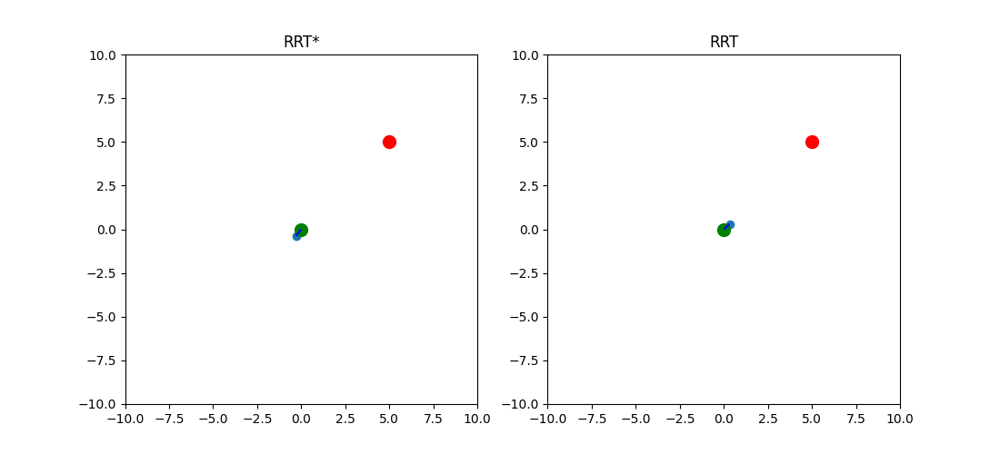
</p>

### RSG (Random Sample Generation)

The RSG algorithm is nearly identical to RRT, except for how it choses what the new node will be. In RRT, we expand in the direction of our sampled node ($`q_{sampled}`$) a maximum $\delta$ distance from the closest node on the tree: $`q_{nearest}`$. In RSG, we generate $N$ random candidate nodes around $`q_{nearest}`$ (sampled with a maximum distance $\delta$), keep nodes with that have a valid edge between themselves and $`q_{nearest}`$, and add the candidate node that is closest to the sampled node.

The following is an example RSG search tree:
<p align="center">
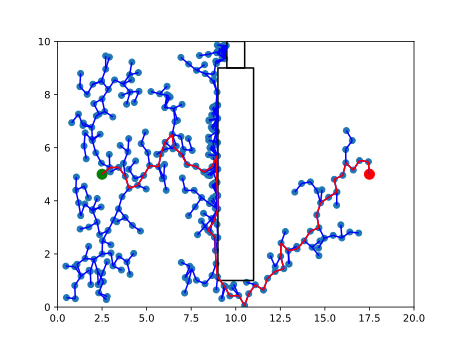
</p>

### PRM (Probabilistic Roadmap)

Unlike RRT which is a single query planner, PRM generates a roadmap that can be required for multiple tasks within the same configuration space. The bulk of the computation for PRM is done during the creation of the roadmap. 


The standard PRM algorithm is as follows:

1. Sample N Random Points in the Configuration Space
2. Validate All Sampled Points and Remove Invalid Points
3. Attempt Edge Connections with either M Neighbors or All Other Points within Radius R and Keep Only Valid Edges
4. Attach the `start` and `target` nodes to the roadmap and validate their edges
5. Use a shortest path algorithm such as Dijkstra's or A* to solve for the path

The following is a GIF of the generation of a PRM
<p align="center">

</p>

### Incremental PRM

Similar to traditional PRM, Incremental PRM also builds a roadmap in the $\mathcal{C}$-Space, but will continue to add nodes until the start and target configuration are in the same connected component. Once $p$ and $q$ are in the same connected component, this means there exists a valid path from start to the target, and thus this search algorithm can stop extending the graph and return the shortest path connecting the start and target via the existing roadmap.

The following is a GIF of Incremental PRM iteratively extending the roadmap to connect the start and target:
<p align="center">

</p>

### NonUniform PRM

Typically, building PRMs sample uniformly in the robot's $\mathcal{C}$-Space; however, many nodes in open areas of the $\mathcal{C}$-Space may not be as beneficial as nodes on the border of $`\mathcal{C}_{free}`$ and $`\mathcal{C}_{obst}`$.

NonUniform PRM works by initially sampling a set of nodes in the configuration space uniformly (just like traditional PRM), adding some normally distributed noise to the points, and comparing if one of the original points or noise affected points are in $`\mathcal{C}_{free}`$ while the other is in $`\mathcal{C}_{obst}`$. This means that we retain the node only if exactly one of the configuration (either the originally sampled one or the noise affected one) is in $`\mathcal{C}_{free}`$. This ensures that retained nodes are typically near $`\mathcal{C}_{obst}`$ regions.

The following is an example of a roadmap generated via the NonUniform PRM algorithm:
<p align="center">
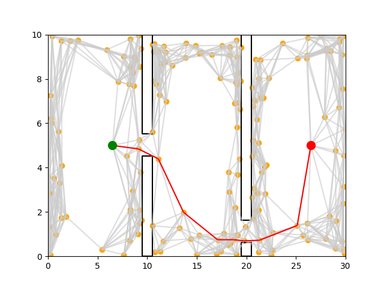
</p>

### Lazy PRM

Lazy PRM works almost exactly like PRM, but delays the most computationally expensive part of the algorithm: the edge collision checks. In traditional PRM, we validate all the edges of our roadmap before attempting to find a path from the start to the target. 

In contrast, Lazy PRM does not validate edges before attempting to search for a path. Instead Lazy PRM validates the edges of only potential paths connecting the start to the target. 

Lazy PRM searchs for an initial potential path in the roadmap. If found, it then validates all the edges in the potential path. If there are no invalid edges in the potential path, the algorithm will simply return that path as the final path. However, if there are invalid edges in the path, Lazy PRM will remove those edges from the roadmap and search again from a path from the start to the target. This will repeat until either a path is found with no invalid edges or it reaches a maximum number of iterations.

The following is a GIF of Lazy PRM Searching for a path with the invalid edges marked in pink:
<p align="center">
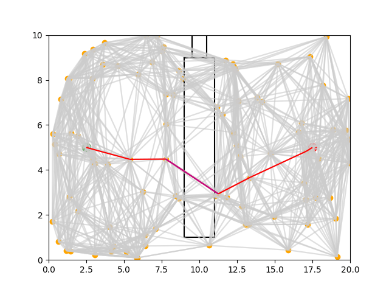
</p>

<!-- # PDG (Path Database Guidance) -->

# Visualizations

## 2D C-Space

For robots whos configuration space is only 2 dimensions, we can fully visualize their configuration space. There are two robots in this library that have implementations compatible with the CSpace visualizer: Disc Robot and Fixed Arm Robot.

The following are example of workspace and their respective configuration space.

Disc Robot Workspace and $\mathcal{C}$-Space Visualization:

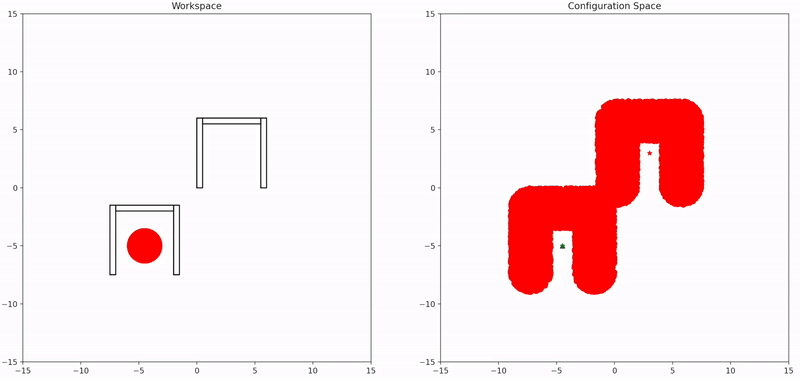

Fixed Arm Workspace and $\mathcal{C}$-Space in Interactive Visualization:

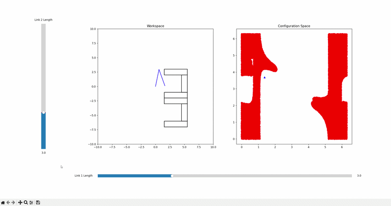

<!-- ## 3D C-Space
 -->

# Accelerated Collision Checks

## Circle Approximations For the Environment and Robot

Environments consisting of rectangles can be approximated using this implementation.

Robots consisting of points/circles, line segments, and rectangles can all be approximated using circles in this implementation.


### Original Robot Representation
<p align="center">
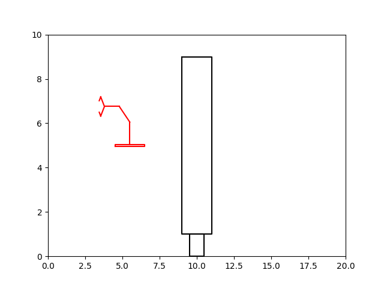
</p>

### Circle Approximation Representation
<p align="center">
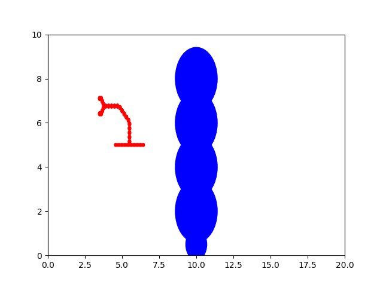
</p>

### Under and Over Approximations
Under approximations mean the circles do not cover the entirety of the rectangular shapes in the environment, include those that are part of the robot and part of the environment obstacles. This leaves the risk of saying an invalid state that falls inside the corner of the rectangular obstacle is valid.
<p align="center">
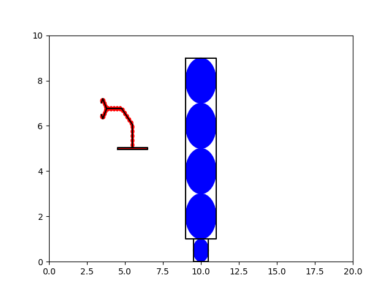
</p>

Over approximations mean the circles do cover the entirety of the rectangluar shapes in the environment. However, it will also spill over into some free space, meaning the $\mathcal{C}_{free}$ will appear smaller than it actually is. This leaves the risk of saying a valid state near the edge of a rectangular obstacle is actually invalid. This is mostly a concern for $\mathcal{C}$-Spaces with narrow passages.
<p align="center">
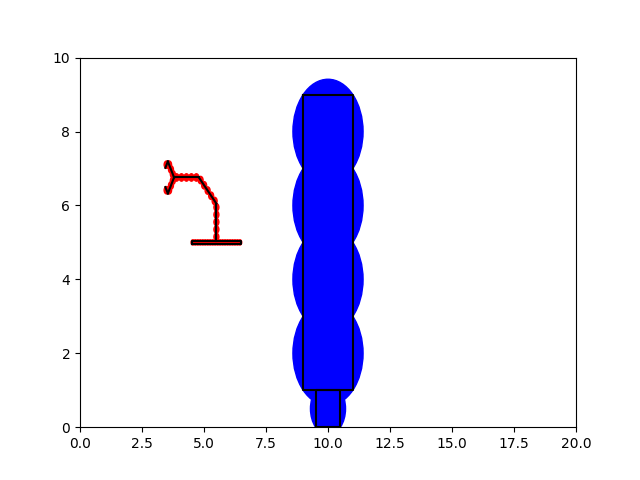
</p>

# Acknowledgements
This repository is heavily inspired by work done during my time at the Parasol Lab working with, at the time, PhD candidate Amnon Attali. A few items in this codebase are a reimplementation intended to better my skills with NumPy and general motion planning fundamentals. 