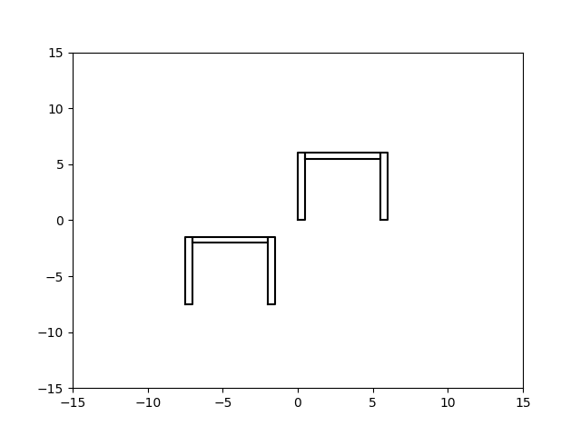
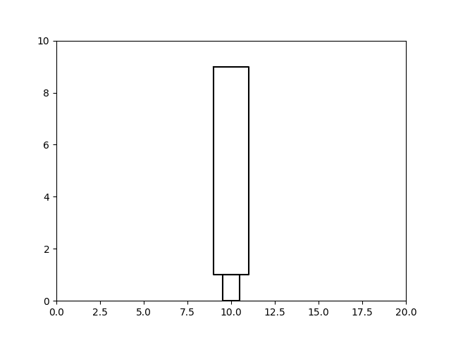
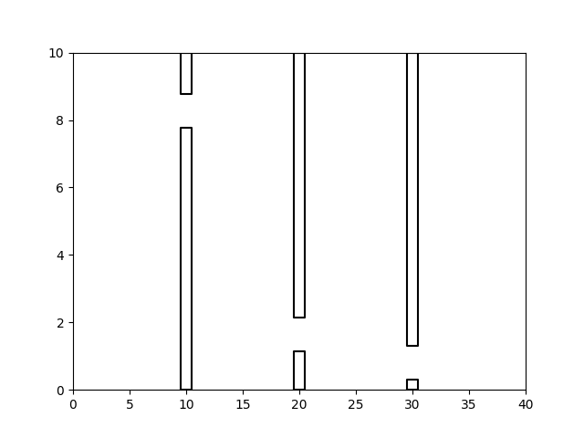
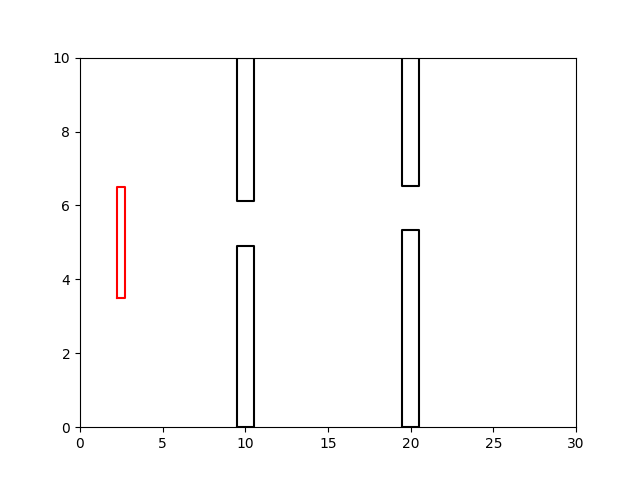
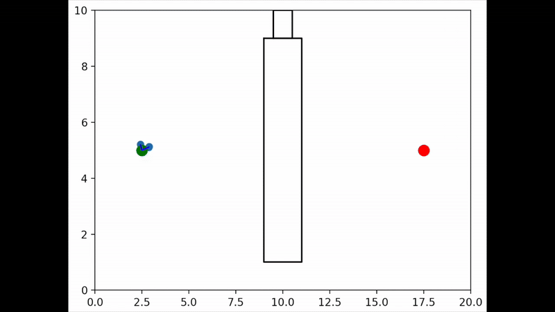
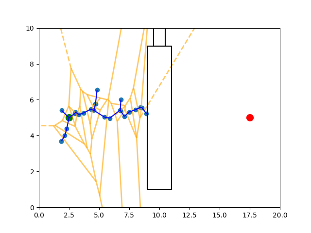
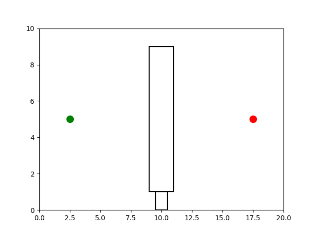
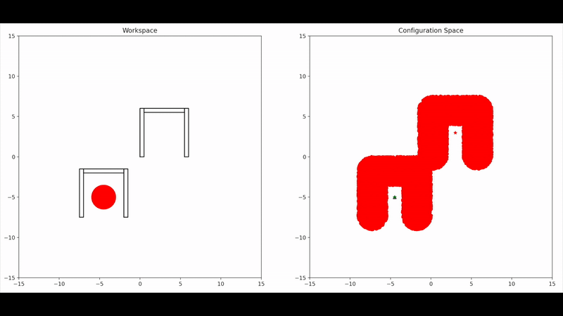

# Praval's Motion Planning Library

## Environments

### Deterministic Environments

#### Parking Space Environment

<!--  -->

### Probabilistic Environments

### Biased Passage
Parameters:
`Num Walls`
`Bias`

### Random Sample Passage
Parameters:
`Num Walls`
`Gap Width`

## Robots

### Point Robot

### Disc Robot

Parameters:
`Radius`

### Polygonal Robot
Parameters:
`Height`
`Width`

< PLACEHOLDER >

<!--  -->

### Planar Mobile Arm
Parameters:
`Base Height?`
`Base Width?`
`Number of Links`
`Length of Links`

## Search Algorithms

This library mostly explores a class of motion planning algorithms known as sampling-based motion planning algorithms. This means each planning algorithm relies on probabilistic properties to alleviate some of the heavy compuation reqired for classical motion planning algorithms.

### RRT

< PLACEHOLDER >

#### Why this works

### Bi-Directional RRT

### RRT*

### RSG

### PRM

< PLACEHOLDER >

### Incremental PRM

### NonUniform PRM

### Lazy PRM

# Visualizations

## 2D C-Space

< PLACEHOLDER >

< PLACEHOLDER >

## 3D C-Space

# Acknowledgements
This repository is heavily inspired by work done during my time at the Parasol Lab working with, at the time, PhD candidate Amnon Attali. A few items in this codebase are a reimplementation intended to better my skills with NumPy operations. 