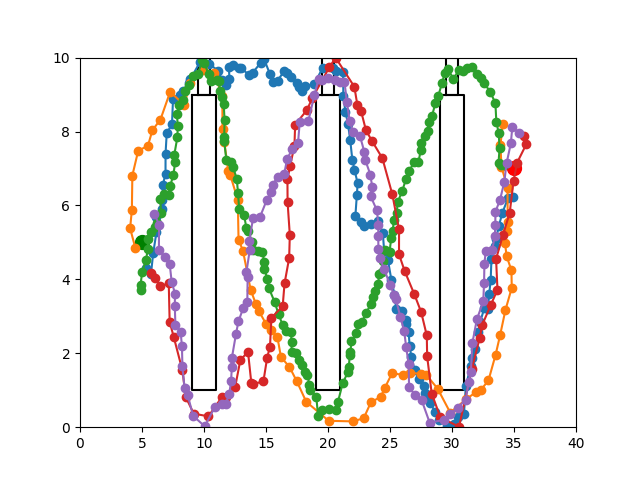
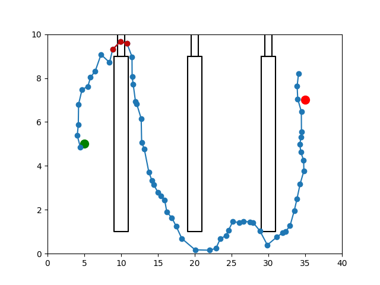
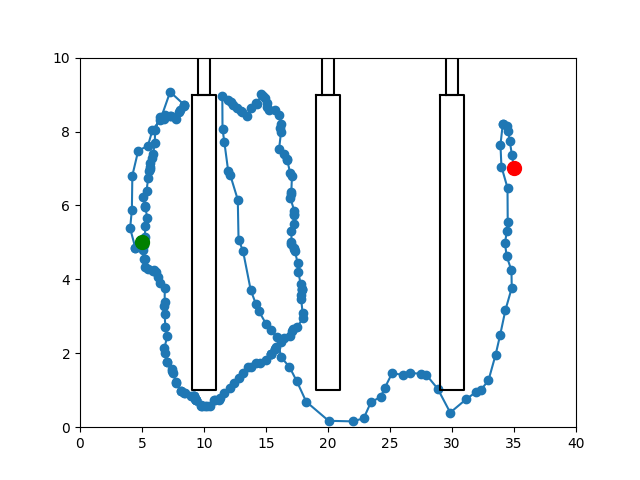

# Lightning

This file is intended to explain how PDG works:

# Environment Distribution

### Biased Passage

# Database

# Algorithm Overview

1. Generate a path database

2. Given a task in an environment, find N paths with the most similar tasks

3. Validate the N paths, and find the path with the least amount of segments in collision

4. Repair the segments in collision using RRT

5. Return the final path (can smooth as well)

